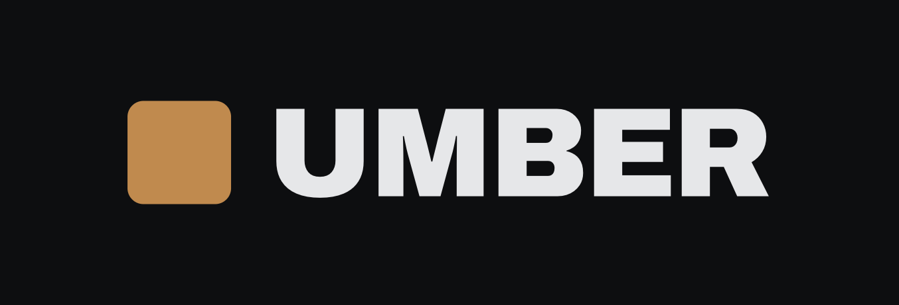
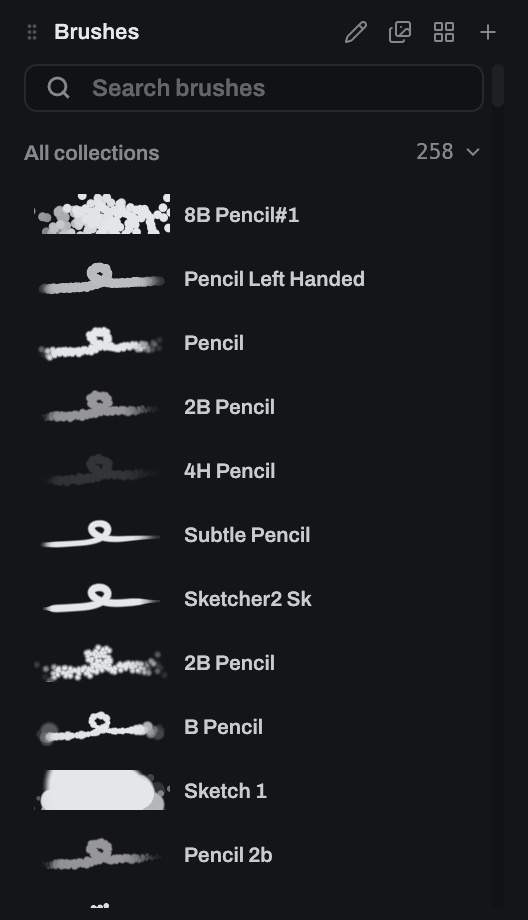
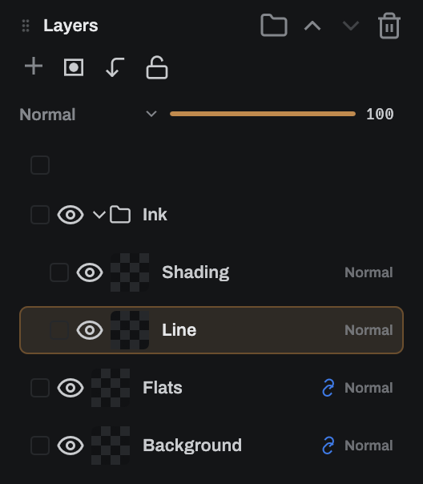
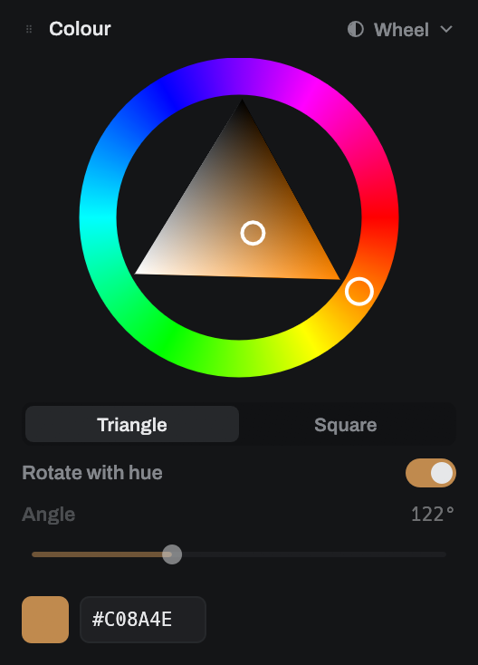
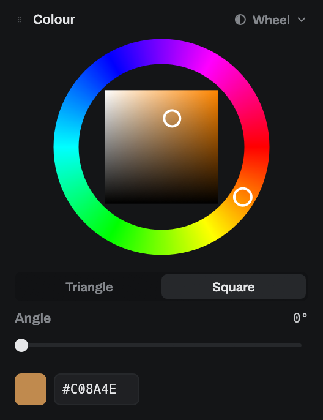
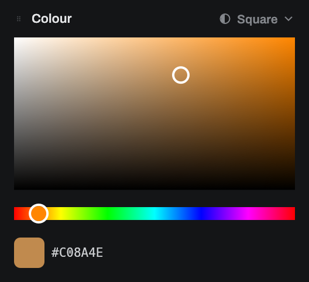
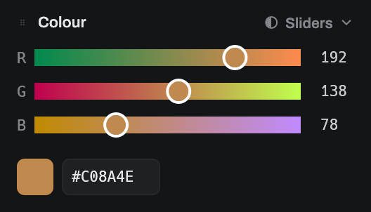
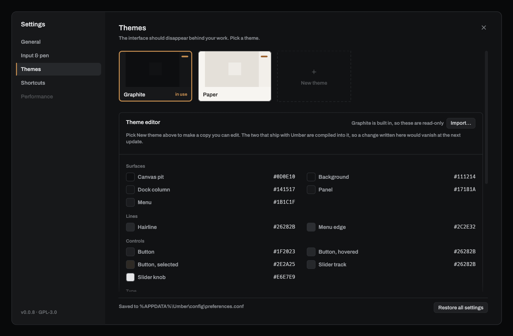
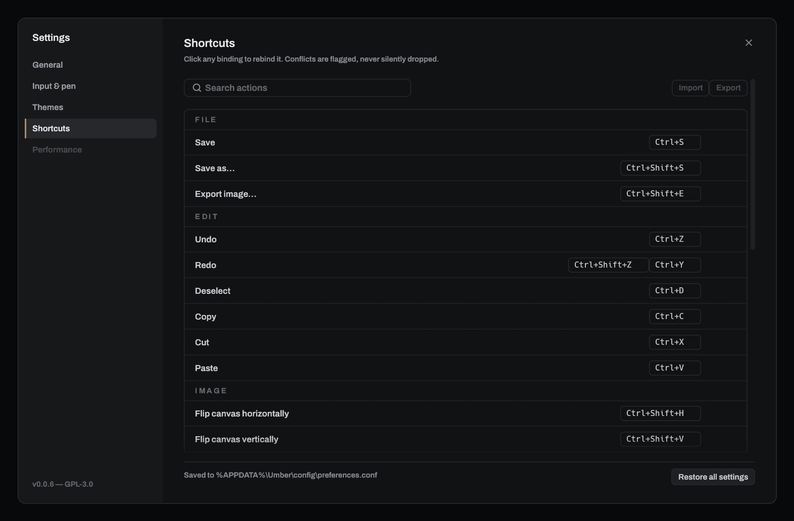

<p align="center">
  <picture>
    <source media="(prefers-color-scheme: light)" srcset="docs/images/banner-paper.png">
    
  </picture>
</p>

<p align="center">
  A painting application built for one thing above all others: <b>latency</b>.
  The shortest possible path between a pen moving and pixels changing.
</p>

<p align="center">
  Paints on the GPU · reads brushes from MyPaint, GIMP, Krita, Photoshop and
  Clip Studio · opens Krita and Photoshop documents · saves to OpenRaster
</p>


> **Early days.** Painting, layers, brushes, documents, selections, transforms,
> text and settings all work on desktop. There is no mobile build yet, and no
> shape tools. [What is not there yet](#what-is-not-there-yet) is honest about
> the rest.

## Install

**Umber 0.0.6.** Take the file for your system, or browse the
[release itself](https://github.com/Spillebulle/umber/releases/latest) for the
notes and the checksums.

| Your system | x86-64 | ARM64 |
|---|---|---|
| Windows | [`.msi` installer](https://github.com/Spillebulle/umber/releases/download/v0.0.6/umber-0.0.6-x64.msi) | [`.msi` installer](https://github.com/Spillebulle/umber/releases/download/v0.0.6/umber-0.0.6-arm64.msi) |
| macOS | [`.tar.gz`](https://github.com/Spillebulle/umber/releases/download/v0.0.6/umber-0.0.6-universal-apple-darwin.tar.gz), one universal binary with both slices | *(the same file)* |
| Debian, Ubuntu, Mint | [`.deb`](https://github.com/Spillebulle/umber/releases/download/v0.0.6/umber_0.0.6_amd64.deb) | [`.deb`](https://github.com/Spillebulle/umber/releases/download/v0.0.6/umber_0.0.6_arm64.deb) |
| Fedora, RHEL, openSUSE | [`.rpm`](https://github.com/Spillebulle/umber/releases/download/v0.0.6/umber-0.0.6-1.x86_64.rpm) | [`.rpm`](https://github.com/Spillebulle/umber/releases/download/v0.0.6/umber-0.0.6-1.aarch64.rpm) |
| Arch | [`.pkg.tar.zst`](https://github.com/Spillebulle/umber/releases/download/v0.0.6/umber-bin-0.0.6-1-x86_64.pkg.tar.zst) | not built |
| Any other Linux | [AppImage](https://github.com/Spillebulle/umber/releases/download/v0.0.6/Umber-0.0.6-x86_64.AppImage), one file with nothing to install | [AppImage](https://github.com/Spillebulle/umber/releases/download/v0.0.6/Umber-0.0.6-aarch64.AppImage) |
| Flatpak | [`.flatpak` bundle](https://github.com/Spillebulle/umber/releases/download/v0.0.6/umber-0.0.6-x86_64.flatpak) | not built |
| Windows, no installer | [`.zip`](https://github.com/Spillebulle/umber/releases/download/v0.0.6/umber-0.0.6-x86_64-pc-windows-msvc.zip) | [`.zip`](https://github.com/Spillebulle/umber/releases/download/v0.0.6/umber-0.0.6-aarch64-pc-windows-msvc.zip) |
| Linux, no package | [`.tar.gz`](https://github.com/Spillebulle/umber/releases/download/v0.0.6/umber-0.0.6-x86_64-unknown-linux-gnu.tar.gz) | [`.tar.gz`](https://github.com/Spillebulle/umber/releases/download/v0.0.6/umber-0.0.6-aarch64-unknown-linux-gnu.tar.gz) |

You need a GPU with Vulkan, Direct3D 12 or Metal, which is essentially any
machine from the last decade. The Linux packages pull in the libraries Umber
opens at runtime, so your package manager handles the rest.

Umber checks for new versions when it starts and shows you the release notes
before anything is downloaded. You can turn that off on the first run, or in
**Settings → General**.

## Brushes



**258 presets ship with Umber**, grouped by what they *do*. Pencils, inks,
markers, charcoal, paint, watercolour, airbrush, blenders, erasers, texture,
foliage, effects. Not by which pack they came from.

Every row draws **a real stroke made by the real brush**, with a loop and a
taper in it, so a rake, a chisel or an angle-following brush looks like what it
is instead of like a flat bar.

196 are the whole of
[mypaint-brushes 2.0.2](https://github.com/mypaint/mypaint-brushes). Another 56
come from CC0 and CC-BY Krita packs: 32 of those stamp a **bitmap tip** rather
than an ellipse, and 6 paint through the author's own **paper texture**. Six are
Umber's own. Each keeps its author and licence.

Blenders work. A smudging brush picks colour up off the canvas and carries it,
and scrubbing back and forth blends its own wet paint. **A brush can carry its
own blend mode**, so a marker multiplies into the paper and a highlighter
screens, without putting the layer they land on into that mode.

<br clear="right">

### Bring your own

**Import brushes…** reads nine formats:

| Format | From |
|---|---|
| `.myb` | MyPaint |
| `.gbr`, `.gpb` | GIMP and Krita stamps |
| `.gih` | GIMP animated brushes, one preset per cell |
| `.vbr` | GIMP parametric brushes, reproduced *exactly* |
| `.kpp` | Krita presets |
| `.bundle` | Krita resource bundles: a whole pack at once, tips and all |
| `.abr` | Photoshop 1, 2, 6.1 and 6.2 |
| `.sut`, `.sutg` | Clip Studio Paint sub-tools, a group arrives whole |
| `.ron` | an Umber library |

A brush leaning on something Umber cannot render is imported **anyway**, and you
are told what was dropped. An approximation of a brush you chose beats a
refusal.

### Make your own

**New brush** starts from scratch, and any brush can take a bitmap stamp: one
from your library, a picture you import, or one you **draw yourself** on a
canvas Umber sets up for it. Stamps and paper textures have a library of their
own, and a paper is previewed tiled so you can see whether its edges meet.

The editor reaches every field a brush has, across six sections: Tip, Dynamics,
Inputs, Scatter, Texture and Blending.

Pressure is not the only thing driving them. Speed, how far into the mark you
are, direction and a throw of the dice per dab can all reach size, opacity,
hardness, scatter, ellipticity, angle and colour.

### Change one mid-painting

**Brush tweaks** is a module for the settings you reach for while a picture is
under way: size, opacity, hardness, spacing, roundness, airbrush rate, angle and
colour pickup. Each has a rail, a keyboard pair and a hold-and-drag grip.

They change the brush in your hand and not the brush you saved. Picking any
brush puts its own settings back.

## Layers



Blend mode, opacity and visibility, plus:

- **Masks.** Greyscale coverage that hides and reveals without touching a pixel.
  Paint the layer or paint its mask; the eraser reveals.
- **Clipping.** A layer that only shows where the one below it does.
- **Locks.** No strokes, transforms or clearing until it comes off, and the
  controls go quiet rather than ignoring you.
- **Link groups.** Up to six colour-coded sets that move through the stack
  together.
- **Folders.** Group, nest, fold shut. A folder's eye and lock reach everything
  inside it, and it travels with its contents.

Every row shows **what is actually on that layer**, scaled to fill the chip
rather than the whole canvas shrunk into it, so a sketch on a large canvas is
still legible. Tick as many rows as you like and show, hide, lock, link, group
or delete them all at once.

Drag a layer sideways as well as up and down to nest it. A dashed outline shows
where it lands, and at what depth, before you let go.

<br clear="right">

## Colour

Four ways to pick one. Either wheel can be turned to whatever angle you like to
work at, and Umber remembers each shape's angle separately.

| Wheel, triangle | Wheel, square | Saturation / value | Sliders |
|---|---|---|---|
|  |  |  |  |

A fifth mode, **Harmony**, marks the complement, triad, tetrad, analogues or
split-complement of the hue you are on and lets you take one with a click.

The **Palette** module keeps the colours you want to come back to. Click a slot
to store what is in hand, and save a whole set into a library. Palettes are
plain GIMP `.gpl` files in a folder of their own, so anything that reads them
can read yours.

## Text

Set a line of text in any font on this machine and place it on the canvas, where
the transform tool moves, scales and turns it before it goes down.

| | |
|---|---|
| Fonts | every one installed, plus a folder of your own if you point Umber at one |
| Shaping | kerning, ligatures and mark positioning, so a word joins up rather than coming out as loose letters |
| Lines | break where you break them; nothing wraps on its own yet |
| Set | family, style, size, line spacing, tracking and alignment |

Placing it works exactly like a paste, so `Esc` abandons it and one undo takes
it back off. It is pixels once it is down, not something that can be re-typed.

## Selections and moving things

**Select** marks out where edits may land: rectangle, freehand lasso, or polygon
point-to-point. Everything the brush and eraser do is clipped to it, antialiased
edges included, so a diagonal is a diagonal rather than a staircase.

Hold `Shift` to add to a selection, `Ctrl` to take away, and both to keep only
where the two overlap. A **feather** softens the edge by as many pixels as you
ask for.

Three buttons sit just above the marquee: **deselect**, **copy** and **cut**.
They stay on screen even when the selection is scrolled half out of view.

**Transform** picks a region up and lets you move, scale and turn it before
putting it down:

| | |
|---|---|
| Drag inside the box | Move it |
| Drag a corner or edge | Scale it; the opposite handle stays put |
| `Shift` while scaling a corner | Keep the proportions |
| Drag outside the box | Turn it |
| `Enter` | Put it down |
| `Esc` | Throw the move away |

Nothing touches the layer until you put it down. Abandoning costs nothing, and
undoing restores both where the pixels went **and** the hole they came from, in
one step.

Copy, cut and paste work across tabs, and with the rest of the machine. A
screenshot pastes straight in, and a region copied out of Umber can be pasted
anywhere else.

## Documents

**Umber saves to OpenRaster** (`.ora`), the same format it reads, so anything
you make here opens in Krita, GIMP, MyPaint, Drawpile and Pinta. There is no
format of its own, deliberately.

| Opens | |
|---|---|
| `.ora` | OpenRaster: Krita, MyPaint, GIMP, Drawpile, Pinta |
| `.kra` | Krita |
| `.psd` | Photoshop |
| `.png` | a flat image |

| Exports | |
|---|---|
| PNG, JPEG, TIFF, GIF, BMP | flattened, with what each format will cost *this* document named before it writes |

Anything lost on the way in is named in a notice when the document opens, rather
than buried in a log: a flattened group, a dropped mask, a blend mode with no
counterpart. Formats that would import subtly wrong are refused by name instead.

Several documents are open at once in tabs, each with its own layers, history
and view. **A saved document carries its undo history**, so one reopened
tomorrow can still be stepped back through.

## The workspace

 

Panels are **locked while you paint** and rearranged in a mode of their own:
**Window → Customise layout**. Drag any module by its header into a column, onto
a column's edge to start a new one, or over the canvas to leave it floating. The
tool rail is a module like any other. Your arrangement is saved between runs.

Two themes ship, and you can make your own from a copy of either. Shortcut
labels follow your own keyboard, so a Nordic layout shows the key that actually
zooms.

**Settings → Input & pen** is the page to open when a pen feels wrong. It shows
what your tablet is sending, beside what Umber made of it.

## Your work is hard to lose

- **Autosave** every five minutes, waiting for a gap between strokes so it never
  interrupts one and never pauses the canvas.
- Documents you have saved are written back. Ones you have not go to a folder of
  Umber's own, and those copies expire after a month, adjustable or off.
  **Nothing Umber deletes is ever a file you chose the place for.**
- Closing with unsaved work asks first, and **names** every document at risk.
- If Umber stops without closing properly, the next start **offers its copies
  back**, naming each document and when it was last written. Opening one puts
  the painting in front of you and writes nothing over the file it came from
  until you save it there yourself. Saying no keeps every copy where it is.
- If Umber does stop, a window opens saying so, and saying whether your work was
  written down and where. The technical details fold out, and go to a file you
  can attach to a bug report. Nothing is sent anywhere.

## Controls

| Input | Action |
|---|---|
| Left drag | Use the selected tool |
| `B` / `E` / `S` / `T` / `H` / `Z` | Brush / eraser / select / transform / pan / zoom |
| `Ctrl` + `D` | Deselect |
| `Ctrl` + `C` / `X` / `V` | Copy / cut / paste |
| `Shift` / `Ctrl` / both + drag with Select | Add to the selection / take away / keep the overlap |
| `Enter` / `Esc` while selecting | Close / abandon the outline |
| `Enter` / `Esc` while transforming | Put the picture down / throw the move away |
| `X` | Swap foreground and background colours |
| `Alt` + click | Pick the colour under the cursor |
| `Alt` + move, nothing held | Resize the brush; right and up is bigger |
| `[` / `]` | Decrease / increase brush size |
| Middle drag, or `Space` + drag | Pan |
| Wheel / `Shift` + wheel | Scroll up and down / side to side |
| `Ctrl` + wheel | Zoom at cursor |
| `Ctrl` + `+` / `-` / `0` / `1` | Zoom in / out / fit / 100% |
| `Ctrl` + `Z`, `Ctrl` + `Shift` + `Z` | Undo / redo |
| `Ctrl` + `Shift` + `H` / `V` | Flip the canvas left-to-right / top-to-bottom |
| `Ctrl` + `S`, `Ctrl` + `Shift` + `S` | Save / save as… |
| Two-finger drag (touch) | Pan and pinch-zoom |

Everything except the held modifiers is rebindable. On macOS `Ctrl` here is
`Cmd`, and the dialog names it that way.

**Pen pressure** works on touch screens and on Windows, where a pen arrives
through Windows Ink carrying 1024 levels. **Pens on macOS and Linux do not reach
Umber through the window system yet.** There it falls back to a flat setting or
a speed-derived approximation, and a mouse always paints at full pressure.

## What is not there yet

- **Ten of the sixteen tools**, shapes among them. What is not built is not
  drawn, rather than drawn and dead.
- **Three things about text**, each of which the panel tells you about rather
  than letting you find out later. Lines break where you break them and nothing
  wraps. A line mixing left-to-right and right-to-left writing is shaped but not
  reordered. A character the chosen face has no glyph for is left blank rather
  than borrowed from another font.
- **Clearing a layer** is the one command that still throws the undo history
  away. Everything else is undoable, including deleting a layer.
- **Transforming a linked set.** Link groups move together through the stack.
  Moving several layers at once on the *canvas* is a larger change.
- **A folder's own opacity and blend mode.** Folders hold layers, and their eye
  and lock reach inside, but a group opacity needs group compositing.
  [`docs/layer-folders.md`](docs/layer-folders.md) has the design and its cost.
- A navigator.

## Building from source

```sh
cargo run --release
```

You need Rust 1.92 or newer. [`docs/architecture.md`](docs/architecture.md) has
the platform prerequisites, how the stroke pipeline works and why it is built
that way. `CLAUDE.md` has every invariant that has to hold.

## Licence

**GPL-3.0-or-later.** Umber is free software: you may use, study, share and
modify it, and anything you distribute that builds on it must be free in the
same way. See [LICENSE](LICENSE).

The shipped brushes carry their own licences, CC0 and CC-BY, and their authors'
names travel with them. [`docs/brush-sources.md`](docs/brush-sources.md) records
every one.

**Archivo**, the typeface, is bundled under the SIL Open Font License.
